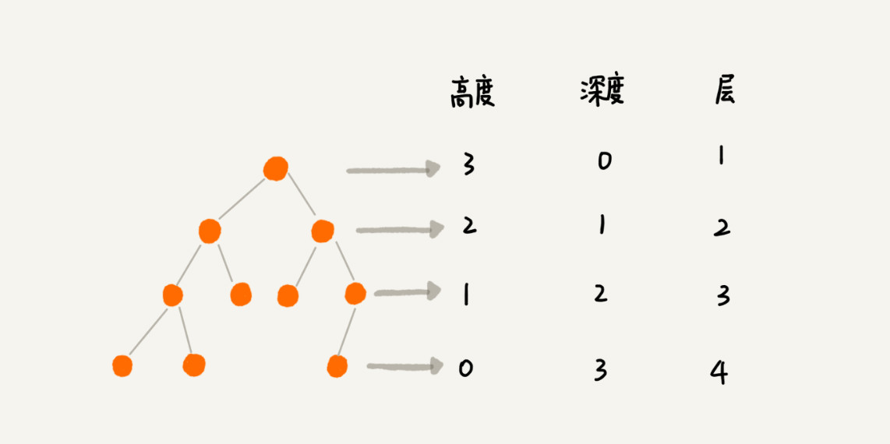

# Binary Tree
## Structure
### Tree
- 非线性表结构
- 高度（Height）、深度（Depth）、层（Level）
  - “高度”这个概念，其实就是从下往上度量,度量第 10 层楼的高度、第 13 层楼的高度，起点都是地面。
  - “深度”这个概念在生活中是从上往下度量的，比如水中鱼的深度，是从水平面开始度量的。
  - "层数”跟深度的计算类似，不过，计数起点是 1，也就是说根节点的位于第 1 层。

### Binary Tree
#### 满二叉树 vs 完全二叉树
**满二叉树**:叶子节点全都在最底层，除了叶子节点之外，每个节点都有左右两个子节点
**完全二叉树**: 叶子节点都在最底下两层，最后一层的叶子节点都靠左排列，并且除了最后一层，其他层的节点个数都要达到最大。

##### 如何表示（或者存储）一棵二叉树
- 基于指针或者引用的链式存储法
- 基于数组的顺序存储法 

  __**顺序存储:**__ 如果节点 X 存储在数组中下标为 i 的位置，下标为 2 * i 的位置存储的就是左子节点，下标为 2 * i + 1 的位置存储的就是右子节点。反过来，下标为 i/2 的位置存储就是它的父节点。
  

如果某棵二叉树是一棵完全二叉树，那用数组存储无疑是最节省内存的一种方式。否则，请看下图：

#### 二叉树的遍历  

- **前**序遍历、**中**序遍历和**后**序遍历

   __表示的是节点与它的左右子树节点遍历打印的先后顺序__

-

## Binary Tree Type